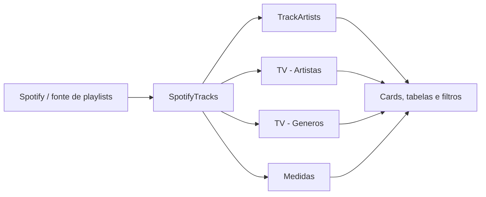

# Spotify Playlist API — Relatório Power BI

## Visão geral

Este repositório contém o arquivo `SpotifyPlaylistAPI.pbix`, um relatório desenvolvido no **Microsoft Power BI** para explorar uma biblioteca de músicas organizada em playlists do Spotify. A documentação foi elaborada a partir da inspeção da definição interna do PBIX, do layout do modelo e dos campos utilizados pelos visuais do relatório.

> Um arquivo `.pbix` pode conter o relatório, o modelo semântico e os dados ou conexões necessários para a sua execução. No Power BI, o modelo semântico é a camada que organiza os dados para análise, incluindo tabelas, cálculos e metadados consumidos pelos visuais [1] [2].

O escopo analítico identificado concentra-se em **volume de faixas**, **artistas**, **álbuns**, **gêneros musicais**, **tempo total de escuta**, **última faixa adicionada** e **data da última atualização**. O relatório apresenta uma página denominada `Página 1`, com o título visual `Playlist Report` e a seção principal `Andamento Playlist`.

## Escopo funcional

O relatório foi estruturado para responder perguntas como: quantas faixas estão presentes nas playlists; qual artista possui mais faixas adicionadas; qual artista concentra o maior tempo de escuta; qual álbum e qual gênero possuem maior volume de faixas; qual foi a última música adicionada; e quando ocorreu a última atualização dos dados.

A página também contém elementos de filtragem por texto e seleção, além de tabelas detalhadas que permitem consultar playlists, músicas, álbuns, artistas e datas de adição. A interação entre filtros e visuais segue o comportamento nativo do Power BI, no qual slicers, filtros e demais visuais podem alterar o contexto de consulta dos elementos relacionados [3].

## Inventário técnico do artefato

| Item | Valor identificado |
|---|---|
| Arquivo principal | `SpotifyPlaylistAPI.pbix` |
| Tipo de artefato | Relatório Power BI com modelo semântico incorporado ou associado |
| Versão interna do pacote | `1.32` |
| Versão da definição do relatório | `3.3.0` |
| Página publicada | 1 página: `Página 1` |
| Nome técnico da página | `91e157ba2f45f1295958` |
| Dimensão do canvas | 1280 × 720 |
| Ajuste de exibição | `FitToPage` |
| Tema | `CY26SU05` |
| Modo de exportação de dados | `AllowSummarized` |
| Drill e filtros | Drill com filtragem de outros visuais habilitado por padrão |
| Atualização | Não identificada na definição extraída |
| Modo de armazenamento | Não identificado na definição extraída |
| Credenciais e conexão | Não documentadas no pacote analisado |

A presença de `DataModel`, `DiagramLayout`, `Settings` e `Metadata` no pacote confirma que o arquivo possui componentes internos de modelo e configuração. A propriedade `CreatedFrom: Cloud` indica que o artefato foi originado a partir de um contexto de serviço/nuvem, mas não permite, isoladamente, determinar a fonte de dados, o endpoint da API ou a política de atualização.

## Modelo semântico

O modelo apresenta cinco entidades identificadas no layout e nas consultas dos visuais. A organização sugere uma tabela principal de faixas, tabelas auxiliares para agregações de artistas e gêneros, uma entidade de relacionamento ou apoio para artistas por faixa e uma tabela dedicada a medidas.

| Entidade | Papel aparente | Campos observados |
|---|---|---|
| `SpotifyTracks` | Tabela principal de faixas e contexto de playlist | `Artistas`, `Nome da Música`, `Nome do Álbum`, `Data Adição`, `Nome da Playlist` |
| `TrackArtists` | Entidade auxiliar para artistas associados às faixas | `Artista 1` |
| `TV - Artistas` | Tabela auxiliar ou visão agregada de artistas | `Artista 1`, `Qtd` |
| `TV - Generos` | Tabela auxiliar ou visão agregada de gêneros | `Genero`, `Qtd` |
| `Medidas` | Tabela lógica para cálculos e indicadores do relatório | Medidas de volume, tempo, ranking, última atualização e imagens dinâmicas |

### Observação sobre relacionamentos

O arquivo `Metadata` informa que não foram detectados relacionamentos **criados automaticamente** (`AutoCreatedRelationships: []`). Isso não deve ser interpretado como prova de que não existem relacionamentos manuais no modelo. A definição analisada não expôs, de forma legível, o catálogo completo de cardinalidade, direção de filtro e chaves; portanto, esses detalhes devem ser validados no modo **Exibição de Modelo** do Power BI Desktop antes de qualquer alteração estrutural.

## Medidas e indicadores

Os seguintes cálculos foram referenciados pelos visuais por meio da entidade `Medidas`:

| Medida | Finalidade de negócio inferida |
|---|---|
| `Total Faixas Playlists` | Quantidade total de faixas nas playlists |
| `Listening Time` | Tempo total de escuta |
| `Ultima Musica Adicionada` | Identificação da faixa adicionada mais recentemente |
| `Porcentagem Volume Playlist` | Participação percentual do volume de faixas |
| `Nome - Artista com Mais Faixas` | Nome do artista com maior quantidade de faixas |
| `Qtd - Artista com Mais Faixas` | Quantidade de faixas do artista líder |
| `Nome - Album com mais faixas` | Nome do álbum com maior quantidade de faixas |
| `QTD - Album Com Mais Faixas` | Quantidade de faixas do álbum líder |
| `Nome - Artista com Mais Listening Time` | Nome do artista com maior tempo de escuta |
| `Qtd - Artista com Mais Listing Time` | Tempo ou quantidade associada ao artista líder em escuta; o nome contém a grafia `Listing` no artefato |
| `Nome - Genero Com Mais Faixas` | Nome do gênero com maior quantidade de faixas |
| `Nome - Gênero com Mais Faixas` | Variante acentuada do indicador de gênero, conforme referenciada no relatório |
| `Qtd - Gênero com Mais Faixas` | Quantidade de faixas do gênero líder |
| `Ultima Atualização UTC` | Momento da última atualização, em UTC |
| `Foto - Album Com Mais Faixas` | Imagem associada ao álbum líder |
| `Foto - Artista com Mais Faixas` | Imagem associada ao artista líder |
| `Foto - Artista com Mais Listening Time` | Imagem associada ao artista líder em tempo de escuta |
| `Foto - Artista do Genero top1` | Imagem associada ao artista do gênero principal |
| `Foto - Ultima Musica Adicionada` | Imagem associada à última faixa adicionada |

A listagem acima representa os nomes e referências disponíveis nos visuais. As expressões DAX completas não foram expostas de forma legível na definição de relatório extraída; por isso, a semântica de cada medida foi documentada como **finalidade inferida**, e não como especificação formal da fórmula. Para auditoria, deve-se abrir o painel **Dados/Fórmula** ou utilizar uma ferramenta de inspeção de modelos tabulares autorizada.

## Campos analíticos

Os principais campos usados diretamente nos visuais são:

| Grupo | Campos |
|---|---|
| Playlist e faixa | `Nome da Playlist`, `Nome da Música`, `Nome do Álbum`, `Data Adição` |
| Artista | `Artistas`, `Artista 1` |
| Gênero | `Genero` |
| Quantidade | `Qtd`, `Sum(TV - Artistas.Qtd)`, `Sum(TV - Generos.Qtd)` |
| Indicadores | Medidas da entidade `Medidas` |

O uso de `Data Adição` indica uma dimensão temporal mínima para ordenar ou identificar recência. Entretanto, não foi encontrada uma tabela calendário explícita entre as entidades expostas no layout. Caso o relatório evolua para análises por mês, semana, ano ou séries temporais, recomenda-se criar e marcar uma dimensão de datas dedicada.

## Composição da página e visuais

A página possui 48 contêineres visuais identificáveis, distribuídos da seguinte forma:

| Tipo de visual | Quantidade | Uso observado ou provável |
|---|---:|---|
| Card | 13 | Indicadores resumidos, como total de faixas, tempo de escuta e última atualização |
| Caixa de texto | 10 | Títulos e textos de apoio |
| Forma | 8 | Estrutura visual e agrupamento do layout |
| Imagem | 6 | Capas ou imagens associadas a artistas, álbuns e faixas |
| Tabela | 3 | Detalhamento de faixas, playlists e artistas |
| Slicer | 2 | Filtros interativos no canvas |
| Text Filter | 2 | Pesquisa textual sobre dados do relatório |

Os visuais personalizados empacotados no arquivo são os seguintes:

| Visual | Versão observada | Função |
|---|---:|---|
| `Text Filter` | 2.2.9.0 | Pesquisa textual aplicada ao contexto do relatório |
| `HTML Content` | 1.6.0.0 | Renderização de valores de colunas ou medidas como HTML |
| `HTML VizCreator Cert` | 2.3.4.0 | Estilização e composição de conteúdo HTML |

Visuais personalizados podem depender de seus pacotes e de compatibilidade com a versão instalada do Power BI Desktop. A documentação oficial recomenda considerar a origem e o ciclo de vida desses visuais ao abrir, publicar ou trabalhar offline com um PBIX [2] [3].

## Fluxo lógico de análise

O diagrama representa o fluxo lógico inferido pelos nomes das entidades e pelos campos referenciados no relatório. Ele não substitui o diagrama formal de relacionamentos do modelo, pois as chaves e a cardinalidade não foram recuperadas de forma legível a partir do pacote.

## Requisitos para abertura e manutenção

Para abrir o arquivo, recomenda-se utilizar a versão mais recente do **Power BI Desktop** compatível com o artefato. A documentação da Microsoft alerta que arquivos PBIX baixados ou produzidos em versões mais novas podem não abrir corretamente em versões antigas [2].

A manutenção deve ser realizada preservando os nomes das medidas e dos campos consumidos pelos visuais. Alterações em `SpotifyTracks`, `TrackArtists`, `TV - Artistas`, `TV - Generos` ou `Medidas` podem quebrar consultas, filtros, imagens dinâmicas e cartões. Antes da publicação, deve-se validar a atualização do modelo, a renderização dos visuais personalizados, os filtros de texto, os cartões e as tabelas detalhadas.

Como a conexão e as credenciais não foram identificadas neste inventário, o responsável pela publicação deve confirmar no Power Query e nas configurações do conjunto de dados: a origem efetiva da API, parâmetros de autenticação, paginação, tratamento de erros, limites de requisição, frequência de atualização e dependências de gateway. Modelos em modo Import precisam de atualização para refletir mudanças na origem; modelos DirectQuery dependem da conectividade com a fonte no momento da consulta [1].

## Qualidade e pontos de atenção

A nomenclatura apresenta variações que merecem padronização futura, como `Genero` e `Gênero`, além de `Listening` e `Listing` no nome de uma medida. Também há dois indicadores semanticamente próximos para gênero (`Nome - Genero Com Mais Faixas` e `Nome - Gênero com Mais Faixas`), o que pode gerar ambiguidade para consumidores e dificultar a manutenção do modelo.

Recomenda-se definir convenções de nomenclatura, documentar as fórmulas DAX, registrar os relacionamentos e declarar explicitamente o modo de armazenamento. Também é recomendável separar medidas de campos físicos, criar uma tabela calendário se houver evolução temporal e manter um inventário dos visuais personalizados e de suas versões.

## Limitações da inspeção

Esta documentação foi baseada nos metadados do pacote PBIX, na definição JSON do relatório, no layout do diagrama e nas referências de campos usadas pelos visuais. O conteúdo binário do `DataModel` não foi tratado como uma especificação tabular legível; consequentemente, não foram afirmados detalhes que não puderam ser verificados diretamente, como fórmulas DAX completas, tipos de dados, chaves, cardinalidade, direção de filtro, origem exata dos dados, credenciais, política de refresh e regras de segurança em nível de linha.

> **Importante:** as descrições de negócio das medidas são interpretações baseadas nos nomes e no contexto de uso. A fórmula efetiva deve ser considerada a fonte de verdade para fins de auditoria e governança.

